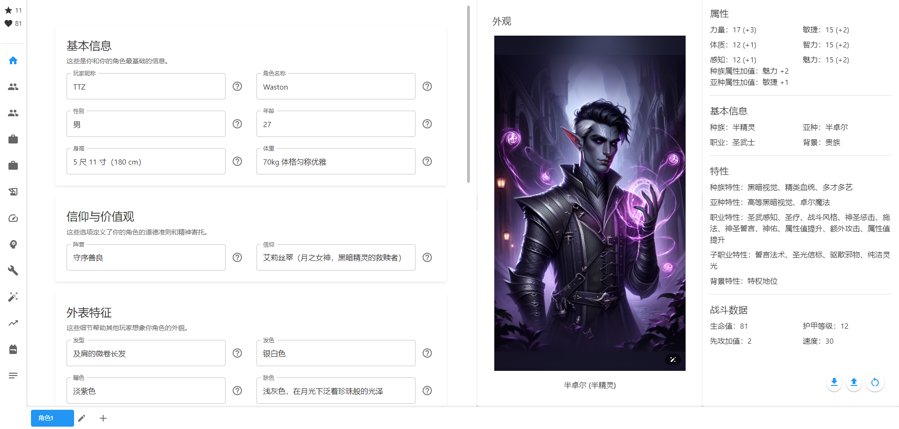
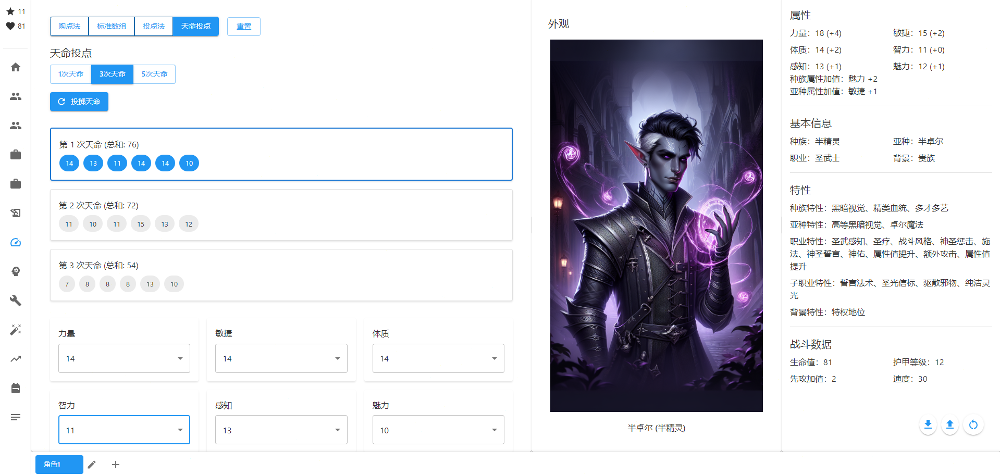
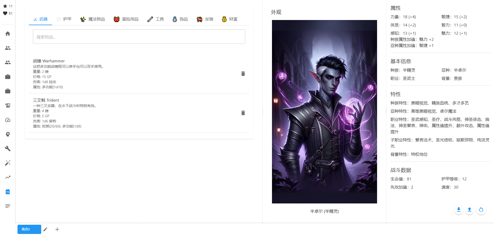
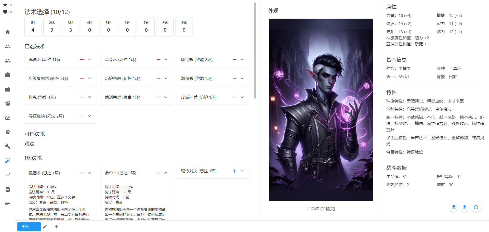
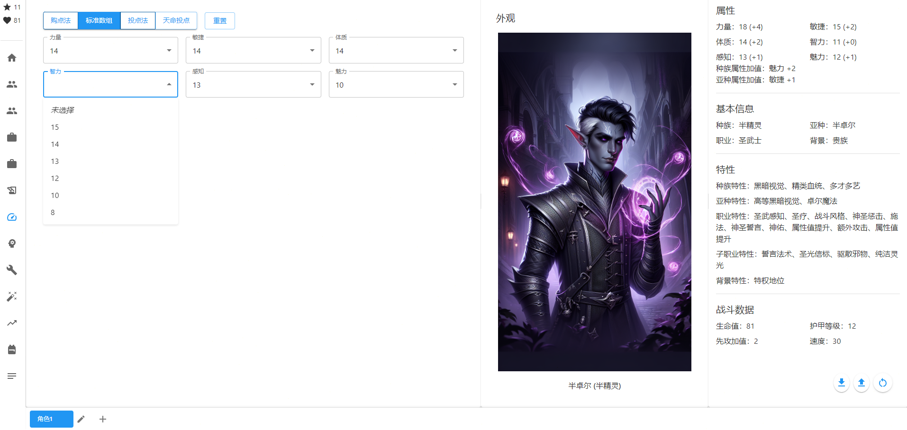
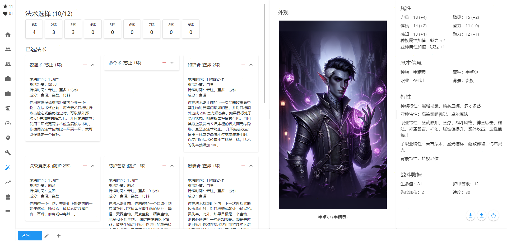

# D&D角色创建系统 (D&D Character Creation System)

<div align="center">


一个基于React的龙与地下城(D&D)角色创建系统，帮助玩家快速创建和管理自己的D&D角色。

[English](./README_EN.md) | 简体中文

</div>

## 🌟 功能特点

- 🎭 完整的角色创建流程
  - 支持所有官方种族和职业
  - 详细的背景故事编辑器
  - 自定义外观描述
  
- 📝 智能属性系统
  - 自动计算属性修正值
  - 种族加成自动应用
  - 技能熟练度智能提示
  
- 🎨 现代化界面
  - 深色/浅色主题切换
  - 响应式设计，支持所有设备
  - 直观的拖拽操作
  
- 💾 数据管理
  - 本地存储角色数据
  - 导出为PDF/JSON/txt/markdown/doc格式
  - 角色数据备份和恢复
  
- 🔄 实时计算
  - 即时属性计算和更新
  - 实时技能检定修正
  - 动态装备负重计算

## 📸 界面预览

<table>
  <tr>
    <td></td>
    <td></td>
  </tr>
  <tr>
    <td></td>
    <td></td>
  </tr>
</table>

## 🎲 特色功能

### 1. 多样化的属性生成系统

- **点数购买系统**
  - 27点数自由分配
  - 实时计算属性调整值
  - 智能提示最优分配方案
  
- **标准数组**
  - 预设[15,14,13,12,10,8]数组
  - 拖拽式分配界面
  - 自动计算种族加成
  
- **天命骰点**
  - 4D6取3
  - 多组对比选择
  - 可视化骰点动画

<div align="center">
  
</div>

### 2. 高级法术系统

- **智能法术位管理**
  - 自动计算不同职业的法术位
  - 支持全施法者/半施法者/三分之一施法者
  - 法术位恢复追踪
  
- **法术书系统**
  - 职业特定法术列表
  - 法术学派分类
  - 法术材料消耗提醒
  
- **法术准备系统**
  - 基于职业和等级的法术准备数量计算
  - 法术位等级限制
  - 施法关键属性提示

<div align="center">
  
</div>

### 3. 先进的导出功能

- **多格式导出**
  - PDF（带角色卡布局）
  - JSON（数据备份）
  - Markdown（富文本展示）
  - TXT（纯文本记录）
  - DOC（文档格式）
  
- **智能数据处理**
  - 自动过滤冗余数据
  - 保持数据完整性
  - 跨设备兼容

<div align="center">
  
</div>

### 4. 技能熟练度系统

- **智能技能计算**
  - 自动应用属性调整值
  - 熟练度加值计算
  - 专长效果整合
  
- **背景影响系统**
  - 自动获得背景技能
  - 可选技能熟练项推荐
  - 熟练项整合

<div align="center">
  
</div>

### 5. 升级系统

- **经验值追踪**
  - 自动计算等级
  - 经验值里程碑提示
  - 升级向导
  
- **属性值提升**
  - 自动解锁属性值提升
  - 属性值上限检查
  - 多选项升级路径

<div align="center">
  
</div>

## 🚀 快速开始

### 系统要求

- Node.js 14.0 或更高版本
- npm 6.0 或更高版本
- 现代浏览器（Chrome, Firefox, Safari, Edge）

### 安装步骤

1. 克隆仓库
```bash
git clone https://github.com/yourusername/dnd-character-creation.git
cd dnd-character-creation
```

2. 安装依赖
```bash
npm install
```

3. 启动开发服务器
```bash
npm start
```

应用将在 http://localhost:3000 启动

## 📖 使用指南

### 创建新角色

1. 点击主页面的"创建新角色"按钮
2. 选择种族和职业
3. 设置基础属性值
4. 选择背景和个性特征
5. 配置技能和专长
6. 选择装备和法术
7. 完成创建并保存

### 管理现有角色

- 在主页面查看所有已创建的角色
- 点击角色卡片进入详细信息页面
- 使用编辑按钮修改角色信息
- 通过导出按钮保存角色数据

### 快捷键

- `Ctrl + S`: 保存当前角色
- `Ctrl + N`: 创建新角色
- `Ctrl + E`: 导出角色数据
- `Ctrl + Z`: 撤销最后的修改

## 🔧 开发者指南

### 项目结构

```bash
dnd-character-creation/
├── src/                # 源代码目录
│   ├── components/    # React组件
│   ├── services/      # 业务逻辑服务
│   ├── hooks/         # 自定义Hooks
│   ├── utils/         # 工具函数
│   └── types/         # TypeScript类型定义
├── public/            # 静态资源
│   ├── data/         # 游戏数据JSON文件
│   └── images/       # 图片资源
├── docs/             # 文档和截图
└── build/            # 构建输出目录
```

### 主要功能模块

1. 角色基础信息
   - 名称、种族、职业设置
   - 背景故事编辑器
   - 个性特征生成器
   
2. 属性系统
   - 六大基础属性计算器
   - 技能熟练度管理
   - 属性调整值自动计算
   
3. 装备系统
   - 武器装备选择器
   - 物品管理器
   - 负重计算器
   
4. 法术系统
   - 法术书管理器
   - 法术位计算器
   - 已知法术追踪器

### 🤝 贡献指南

我们欢迎所有形式的贡献，包括但不限于：

- 提交问题和建议
- 改进文档
- 提交代码修改
- 添加新功能

请确保在提交Pull Request之前：

1. 更新相关文档
2. 添加必要的测试
3. 遵循现有的代码风格
4. 提供清晰的提交信息

## 📝 更新日志

### 版本 1.1.0 (2024-02-15)
- 新增角色导出为PDF功能
- 修复多个已知问题

### 版本 1.0.0 (2024-01-01)
- 初始版本发布
- 完整的角色创建功能
- 基础属性计算系统
- 装备和物品管理

## 📄 许可证

本项目采用 ISC 许可证。详见 [LICENSE](LICENSE) 文件。

## 📮 联系方式

如有问题或建议，请通过以下方式联系我们：

- 提交 [Issue](https://github.com/yourusername/dnd-character-creation/issues)
- 发送邮件至 [531775378@qq.com]

## 🙏 致谢

感谢所有为这个项目做出贡献的开发者。特别感谢：

- D&D 5E SRD 提供的开放游戏内容
- React 和 Material-UI 团队提供的出色框架
- 所有测试和反馈的用户

---

<div align="center">
⚔️ 🎲 ∷∷∷∷∷∷∷∷∷∷∷ [D&D] ∷∷∷∷∷∷∷∷∷∷∷ 🎲 ⚔️
</div>

**Happy Gaming! 祝您游戏愉快！**
