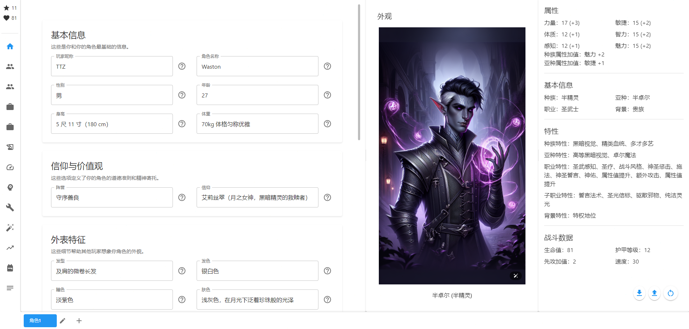
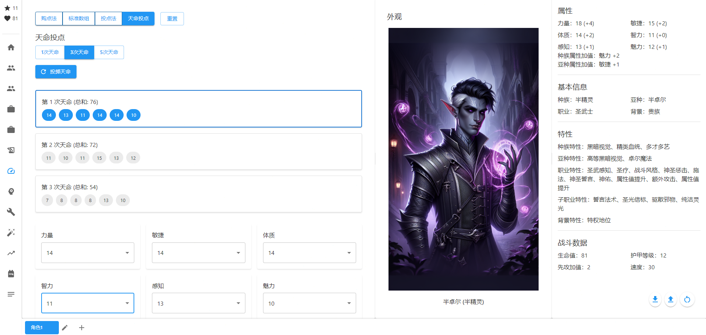
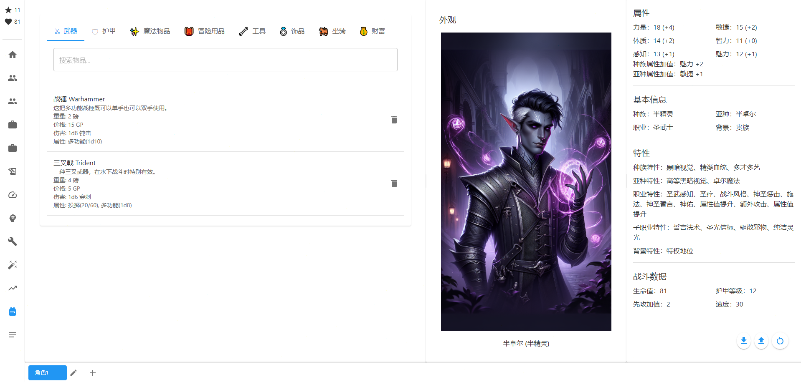
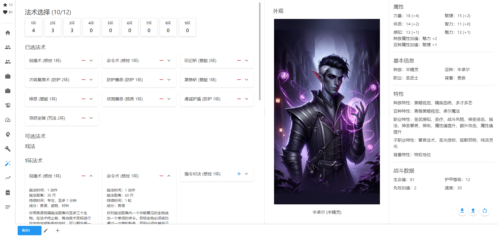
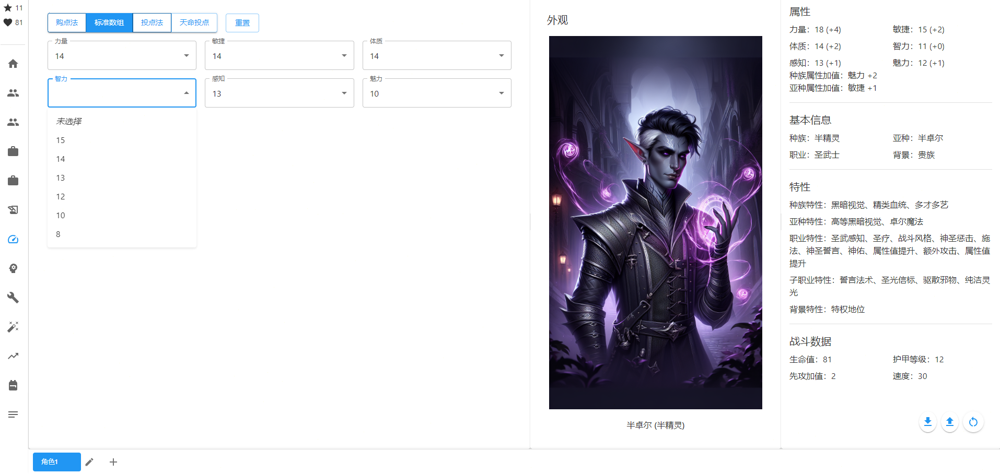
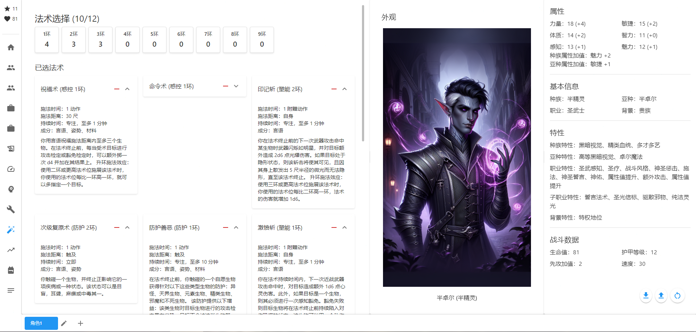
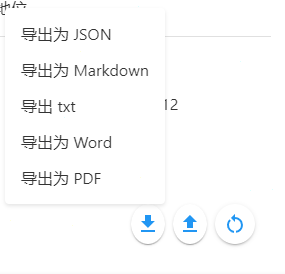
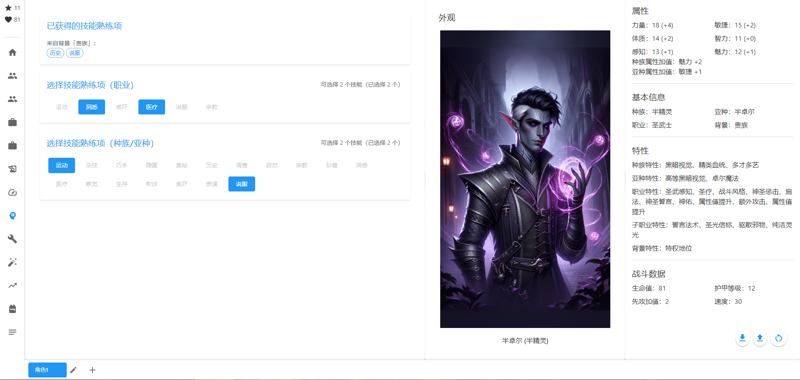
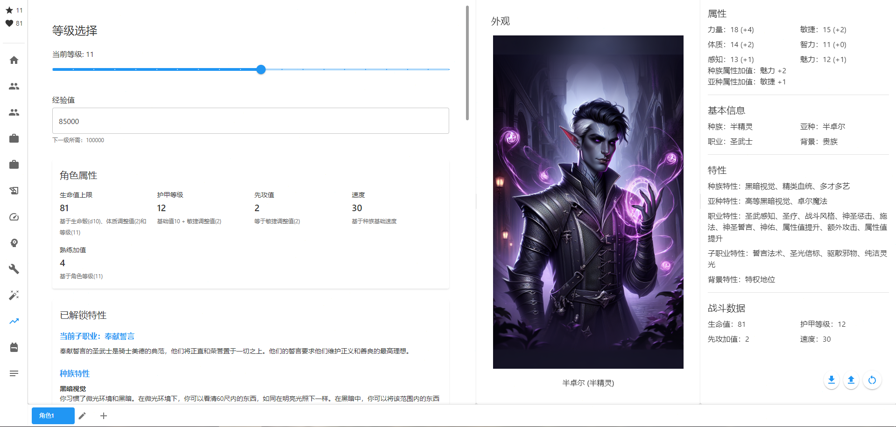

# D&D Character Creation System

<div align="center">


A React-based D&D (Dungeons & Dragons) character creation system that helps players quickly create and manage their D&D characters.

[简体中文](./README.md) | English

</div>

## 🌟 Features

- 🎭 Complete Character Creation Process
  - Support for all official races and classes
  - Detailed background story editor
  - Customizable appearance descriptions
  
- 📝 Smart Attribute System
  - Automatic modifier calculations
  - Racial bonus auto-application
  - Skill proficiency smart suggestions
  
- 🎨 Modern Interface
  - Dark/Light theme switching
  - Responsive design for all devices
  - Intuitive drag-and-drop operations
  
- 💾 Data Management
  - Local character data storage
  - Export to PDF/JSON/txt/markdown/doc formats
  - Character data backup and recovery
  
- 🔄 Real-time Calculations
  - Instant attribute updates
  - Real-time skill check modifiers
  - Dynamic equipment load calculation

## 📸 Interface Preview

<table>
  <tr>
    <td></td>
    <td></td>
  </tr>
  <tr>
    <td></td>
    <td></td>
  </tr>
</table>

## 🎲 Special Features

### 1. Diverse Ability Generation System

- **Point Buy System**
  - 27 points for free allocation
  - Real-time modifier calculation
  - Smart allocation suggestions
  
- **Standard Array**
  - Preset [15,14,13,12,10,8] array
  - Drag-and-drop interface
  - Automatic racial bonus calculation
  
- **Destiny Roll**
  - 4D6 drop lowest
  - Multiple set comparison
  - Visual dice rolling animation

<div align="center">
  
</div>

### 2. Advanced Spell System

- **Smart Spell Slot Management**
  - Automatic spell slot calculation for different classes
  - Support for full/half/third casters
  - Spell slot recovery tracking
  
- **Spellbook System**
  - Class-specific spell lists
  - School of magic classification
  - Material component reminders
  
- **Spell Preparation System**
  - Class and level-based preparation calculations
  - Spell slot level restrictions
  - Spellcasting ability suggestions

<div align="center">
  
</div>

### 3. Advanced Export Features

- **Multi-format Export**
  - PDF (with character sheet layout)
  - JSON (data backup)
  - Markdown (rich text display)
  - TXT (plain text record)
  - DOC (document format)
  
- **Smart Data Processing**
  - Automatic redundant data filtering
  - Data integrity maintenance
  - Cross-device compatibility

<div align="center">
  
</div>

### 4. Skill Proficiency System

- **Smart Skill Calculation**
  - Automatic ability modifier application
  - Proficiency bonus calculation
  - Feat effect integration
  
- **Background Impact System**
  - Automatic background proficiencies
  - Optional proficiency suggestions
  - Proficiency integration

<div align="center">
  
</div>

### 5. Leveling System

- **Experience Tracking**
  - Automatic level calculation
  - XP milestone notifications
  - Level-up wizard
  
- **Ability Score Improvements**
  - Automatic ASI unlocking
  - Ability score cap checking
  - Multiple upgrade paths

<div align="center">
  
</div>

## 🚀 Quick Start

### System Requirements

- Node.js 14.0 or higher
- npm 6.0 or higher
- Modern browsers (Chrome, Firefox, Safari, Edge)

### Installation Steps

1. Clone the repository
```bash
git clone https://github.com/yourusername/dnd-character-creation.git
cd dnd-character-creation
```

2. Install dependencies
```bash
npm install
```

3. Start development server
```bash
npm start
```

The application will start at http://localhost:3000

## 📖 User Guide

### Creating a New Character

1. Click "Create New Character" on the main page
2. Select race and class
3. Set ability scores
4. Choose background and personality traits
5. Configure skills and feats
6. Select equipment and spells
7. Complete creation and save

### Managing Existing Characters

- View all created characters on the main page
- Click character cards to view details
- Use edit button to modify character information
- Export character data via export button

### Keyboard Shortcuts

- `Ctrl + S`: Save current character
- `Ctrl + N`: Create new character
- `Ctrl + E`: Export character data
- `Ctrl + Z`: Undo last modification

## 🔧 Developer Guide

### Project Structure

```
dnd-character-creation/
├── src/                # Source code directory
│   ├── components/    # React components
│   ├── services/      # Business logic services
│   ├── hooks/         # Custom Hooks
│   ├── utils/         # Utility functions
│   └── types/         # TypeScript type definitions
├── public/            # Static resources
│   ├── data/         # Game data JSON files
│   └── images/       # Image resources
├── docs/             # Documentation and screenshots
└── build/            # Build output directory
```

### Core Features

1. Character Basic Information
   - Name, race, class settings
   - Background story editor
   - Personality trait generator
   
2. Ability System
   - Ability score calculator
   - Proficiency management
   - Modifier auto-calculation
   
3. Equipment System
   - Weapon and equipment selector
   - Item manager
   - Encumbrance calculator
   
4. Spell System
   - Spellbook manager
   - Spell slot calculator
   - Known spell tracker


## 🤝 Contributing

We welcome all forms of contributions, including but not limited to:

- Submitting issues and suggestions
- Improving documentation
- Submitting code changes
- Adding new features

Please ensure before submitting a Pull Request:

1. Update relevant documentation
2. Add necessary tests
3. Follow existing code style
4. Provide clear commit messages

## 📝 Changelog

### Version 1.1.0 (2024-02-15)
- Added PDF character export feature
- Fixed multiple known issues

### Version 1.0.0 (2024-01-01)
- Initial release
- Complete character creation functionality
- Basic attribute calculation system
- Equipment and item management

## 📄 License

This project is licensed under the ISC License. See the [LICENSE](LICENSE) file for details.

## 📮 Contact

For questions or suggestions, please contact us through:

- Submit an [Issue](https://github.com/yourusername/dnd-character-creation/issues)
- Send email to [531775378@qq.com]

## 🙏 Acknowledgments

Thanks to all developers who contributed to this project. Special thanks to:

- D&D 5E SRD for providing open game content
- React and Material-UI teams for excellent frameworks
- All users who tested and provided feedback

---

<div align="center">

```
⚔️ 🎲 ∷∷∷∷∷∷∷∷∷∷∷ [D&D] ∷∷∷∷∷∷∷∷∷∷∷ 🎲 ⚔️
```

**Happy Gaming!**
</div>
